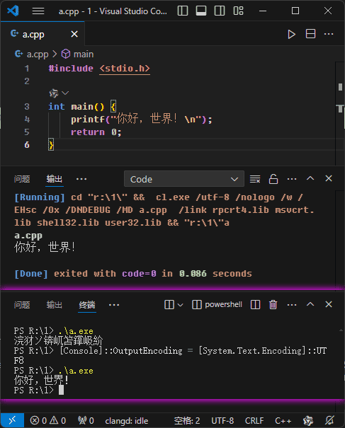

# cpp
C/C++零基础入门 系列教程 不懂英文 从零开始

##  [MSVC2022_ForCPG.7z](https://drive.google.com/file/d/1Nz2QoVcLMdKf6FHJDYA0euT2Bh9x8W3h/view?usp=sharing)    2025.03.02
- https://drive.google.com/file/d/1Nz2QoVcLMdKf6FHJDYA0euT2Bh9x8W3h/view?usp=sharing

### github源码:  https://github.com/hongwenjun/cpp
## [【C/CPP零基础入门_Part01_排序算法 冒泡排序】](https://b23.tv/CCcx3mX)
### https://b23.tv/CCcx3mX

## 简介
### C/C++零基础入门: 不懂英文 从零开始
- 学习C/C++编程对于零基础的人来说可能会有一些挑战，但是掌握这门语言将会为你打开许多机会。
- 本系列教程会分享一些学习的工具和资源，只要对照视频开始学习C/C++，就可以了解基本的语法和概念，
比如变量、数据类型、条件语句和循环结构等。

[](https://www.bilibili.com/video/BV1D8411y7ya)

### C/CPP零基础入门编程软件资源
https://wwcz.lanzout.com/b01urh63a   密码:7q5c

- `算法动画图解_中文欢乐版.apk`  视频右侧的 算法动画图解 程序
- `MSVC2015Mini.7z`    视频中 VSCODE 调用的 C/C++ 编译器

https://wwm.lanzout.com/b0r9anaqb  密码:1diw
- MSVC2022_编译器X64便携版.7z
- tdm64-gcc-10.3.0-2.exe 等 C/C++编译器资源

## VS Code 配置 CodeRunner 使用 MSVC编译器 和 显示中文不乱码
- 下载 `MSVC2022_X64_mini.7z` 压缩包解压到任意目录下, 推荐 C:\MSVC2022
- 配置环境变量，添加参考如下
```
INCLUDE=C:\MSVC2022\include
LIB=C:\MSVC2022\lib
Path=C:\MSVC2022\bin;%PATH%
```

- 配置 `CodeRunner`  修改配置文件 `settings.json` , 给 `cl.exe` 添加参数 UTF-8 编码、不显示警告、编译优化、链接库等参数
```
"cpp": "cd $dir &&  cl.exe /utf-8 /nologo /w /EHsc /Ox /DNDEBUG /MD $fileName  /link rpcrt4.lib msvcrt.lib shell32.lib user32.lib && $dir$fileNameWithoutExt",
"c": "cd $dir  &&  cl.exe /utf-8 /nologo /w /EHsc /Ox /DNDEBUG /MD $fileName  /link rpcrt4.lib msvcrt.lib shell32.lib user32.lib && $dir$fileNameWithoutExt"
```

- 设置 PowerShell 的默认输出编码为 UTF-8:

```
[Console]::OutputEncoding = [System.Text.Encoding]::UTF8
```




## [使用GPT 3.5 学习C语言: 25个简单代码让你了解 C 语言基本语法](./base/)

## [C/C++零基础入门 学习收集的示例代码](./examples/)

## [OpenCV图像处理 学习代码](./opencv/)
```
# OpenCV 官方下载地址:
https://opencv.org/releases/

# 原始文件:
https://github.com/opencv/opencv/releases/download/4.10.0/opencv-4.10.0-windows.exe


# 安装位置: 解压到 MSVC2022 编译器目录
C:\MSVC2022
```
